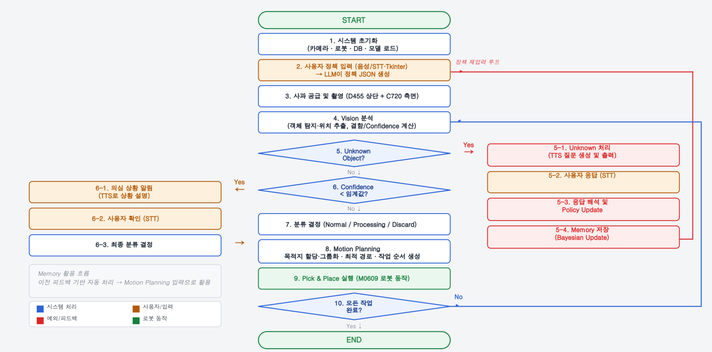
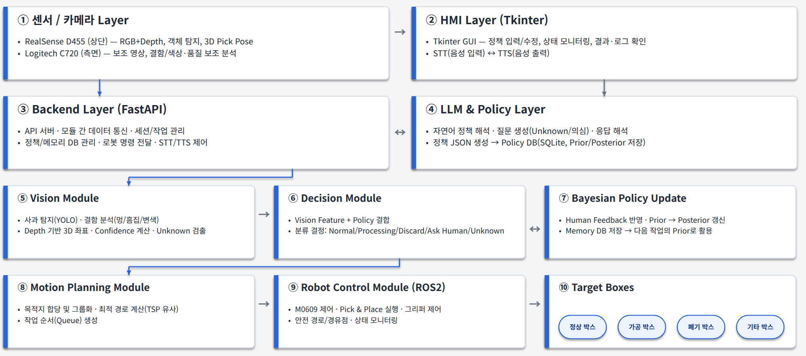

# Apple Care

사람의 피드백으로 자율성이 성장하는 **Bayesian VLA 협동 사과 분류 로봇**

AI(Computer Vision) 기반 협동 로봇 작업 어시스턴트 — 애매한 판단(흠집·곰팡이 경계, 미학습 객체)은 사람에게 묻고, 그 피드백을 베이지안 방식으로 기억해 같은 상황이 반복되면 스스로 판단하는 Human-in-the-Loop 시스템.

> Apple VLA Project | TEAM B-4 (구나영 · 박선욱 · 박채송 · 이현민) | MENTOR 이충현 · 두산로보틱스

---

## 주요 기능

- **자연어 기반 분류 정책 (VLA)**: 고정된 코드 규칙 대신 자연어 한마디로 사과 분류 정책을 즉시 반영
- **Bayesian HITL (Human-in-the-Loop)**: 애매한 판단은 자동 강행하지 않고 사람에게 확인 → 답변을 Beta(α, β) 분포로 누적해 신뢰도 갱신
- **EVPI 동적 질문 게이트**: 고정 임계값이 아니라 `기대정보가치(EVPI) vs 질문 비용(대기열·지연)`을 계산해 "지금 물어볼 가치가 있는지" 동적으로 판단
- **계층적 베이지안 Prior**: 완전히 새로운 과일 종류가 나타나도 다른 과일에서 학습한 경험을 살짝 빌려와 시작 (pseudo-count)
- **미학습 객체 대응 (Vision-LLM Multimodal)**: YOLO가 모르는 물체는 GPT-4o Vision에게 먼저 이름표를 확인한 뒤 사람에게 질문/학습
- **4단계 독립 안전장치 (Vision)**: YOLO confidence 게이트 → Depth 높이차 검증 → 라벨 신뢰 게이트 → 실측 크기 검증, 서로 다른 실패 원인을 각 단계가 독립적으로 방지
- **픽셀별 배경 캘리브레이션**: 고정 스칼라 배경거리 대신, 픽셀별 median 배경 지도와 비교해 기울어진 트레이·펜스 등 고정 구조물 오탐 제거
- **다수결 기반 시간적 안정화**: 1회 판정 대신 여러 폴링을 모아 다수결로 확정, `empty` 판정은 3회 연속 확인 후에만 상태 리셋
- **적응형 파지력 제어**: 손목 힘 센서로 베이스라인 대비 편차를 측정해 1단계씩 힘을 증가(임계값 3.0N, 안전 여유 +2단계) — 사과 크기를 몰라도 으깨짐/미끄러짐 방지
- **힘 기반 배치(Force-based Placement)**: 박스가 비었는지 몰라도 접촉 감지 즉시 정지, 항상 안전하게 배치
- **트레이 벽 회피(대각선 접근)**: 벽 근처 10° 틸트, 모서리(2면 근접) 22° 틸트로 그리퍼-벽 충돌 방지
- **이중 정지 구조의 E-STOP**: 이동 중 10ms · 힘제어(파지/배치) 중 0.5초 간격 상시 폴링으로 동작 단계 완료를 기다리지 않고 즉시 정지, 재개는 반드시 운영자 RESUME으로만
- **바스켓 점유 모니터링 (세컨 카메라)**: 별도 웹캠 + 동일 YOLO 체크포인트로 바구니 4개 점유 상태 상시 관찰, Sticky 보정(최대 20프레임)으로 순간 미검출 방지
- **실시간 HMI 대시보드 (Tkinter)**: 실시간 모니터링(Cam1 YOLO 검출 / Cam2 바구니) · VLA 정책 관리 · 시스템·로봇 수동 제어(START/PAUSE/E-STOP, 관절 슬라이더) · 시스템 로그, WebSocket 큐 기반 100ms 폴링으로 스레드 안전하게 갱신

## 시스템 설계

### 전체 시스템 플로우



> 정책 입력부터 Vision 분석 → Unknown/Confidence 분기(HITL) → 분류 결정 → Motion Planning → Pick & Place까지의 전체 루프. 원본: [docs/flowchart.png](docs/flowchart.png)

### 레이어 아키텍처



> 센서/카메라 → HMI/LLM·Policy → Backend → Vision/Decision/Bayesian Policy Update → Motion Planning/Robot Control → Target Boxes로 이어지는 10개 레이어 구조. 원본: [docs/system_architecture.png](docs/system_architecture.png)

### 박스 매핑

| 정책 결과 | 물리 박스 | 경유점 |
|---|---|---|
| `normal_box` | B3 | WAY1 |
| `ugly_box` | B2 | WAY1 |
| `processing_box` | B1 | WAY1 |
| `discard_box` | B4 | WAY2 |

### 판단(Decision) 파이프라인 — "언제 사람에게 물어볼까"

```
① YOLO 확신도 체크
② 질문 밀림 확인 (Congestion, 대기열 6개 초과 시 자동 처리)
③ [모르는 물체만] GPT-4o Vision에게 확인
④ 물어볼 가치 있나? EVPI_human = (1-p) × L_error  vs  Cost_human(t) = k1·n(t)/(C-n(t)) + k2·τ(t)
⑤ 사람 답변 → Beta(α, β) 믿음 업데이트 (계층적 prior로 신규 항목도 완전히 0부터 시작하지 않음)
⑥ 전부 기록 (Audit Log)
```

## 운영체제 환경

| 항목 | 버전/사양 |
|---|---|
| OS | Ubuntu (ROS2 Humble 대상 배포판) |
| ROS2 배포판 | Humble (jazzy도 호환됨) |
| Python | 3.10 (backend/robot/vision 공통) — STT 웨이크워드 의존성은 3.12 분기 별도 지원 |
| 빌드 시스템 | colcon (`colcon build --symlink-install`) |

## 활용 장비

| 구분 | 장비/재료 |
|---|---|
| 협동로봇 | 두산 협동로봇 M0609 |
| End-Effector | OnRobot RG2 그리퍼 |
| 비전 센서 | Intel RealSense D455 (상단, 피킹용) · Logitech C720/C270 (측면, 바구니 점유 확인용) |
| 테스트베드 | 사과 트레이 + 분류 박스 4개 (B1~B4) |
| 실험 환경 | 실내 피킹 테스트 리그 (트레이·박스·듀얼 카메라 구성) |

### 소프트웨어 / 기술 스택

| 구분 | 스택 |
|---|---|
| 로봇 제어 | ROS2 (Humble) · Python 3.10 |
| 백엔드/통신 | FastAPI · Uvicorn · WebSocket |
| 프론트엔드/GUI | Tkinter |
| 데이터베이스 | SQLite (정책 메모리 · HITL 피드백 · 의사결정 감사로그) |
| AI/Vision 판단 | YOLO · OpenAI GPT-4o (VLM) · SmolVLA (실험적 확장) |

## 프로젝트 구조

```
apple-care/
├── code/
│   ├── backend/        # FastAPI 서버 (판단/베이지안/HITL/LLM/DB) — main.py 진입점
│   ├── hmi_app/         # Tkinter 대시보드 — view/dashboard.py 진입점
│   ├── robot_ws/        # ROS2 워크스페이스 (apple_care_robot 패키지: 모션 플래닝·로봇 제어)
│   └── vision_ws/       # ROS2 워크스페이스 (obj_detection, apple_care_msgs 패키지: 비전 인식)
├── data/                # 런타임 데이터 (robot_system.db 등, git 비추적)
├── docs/                # 백엔드/비전 아키텍처 설계 원칙 문서
├── tools/               # colcon 빌드 보조 스크립트
└── 실행.txt             # 실행 순서 원본 메모
```

## 의존성 설치

### Backend (FastAPI)

```bash
cd code/backend
pip install -r requirements.txt
```

주요 패키지: `fastapi`, `uvicorn[standard]`, `sqlalchemy`, `pydantic`, `websockets`, `openai`, `numpy<2`(ROS2 Humble `cv_bridge`와의 ABI 호환을 위해 1.x 고정), `sounddevice`/`soundfile`/`pyaudio`(STT/TTS), `openwakeword`(웨이크워드, 선택)

### ROS2 워크스페이스 (vision_ws, robot_ws)

`rclpy`, `cv_bridge`, `python3-pymodbus`, `python3-numpy`, `python3-scipy` 등 ROS2 Humble apt 의존성이 필요합니다. 각 패키지의 `package.xml` 기준으로 `rosdep install`을 사용하거나 두산 협동로봇 패키지(그리퍼 포함)·RealSense 드라이버가 이미 설치된 환경을 전제로 합니다.

### 환경 변수 (backend/.env)

`config.py`가 `.env`를 로드합니다. 최소 아래 값을 설정하세요.

```bash
OPENAI_API_KEY=sk-...        # GPT-4o Vision(미학습 객체 질의) · STT/TTS 필수
OPENAI_MODEL=gpt-4o
APP_HOST=0.0.0.0
APP_PORT=8000
ROS_TOPIC_NAME=/dsr01/state
CONFIDENCE_THRESHOLD=0.7
```

그 외 베이지안/HITL/음성 관련 임계값(`BAYESIAN_PRIOR_ALPHA`, `HUMAN_QUERY_COST_K1/K2`, `HITL_MAX_REASK_ATTEMPTS`, `VOICE_WAKEWORD_ENABLED` 등)은 `code/backend/config.py`를 참고하세요.

## 실행 순서

> 전제: 그리퍼가 달린 두산로봇팔 패키지, RealSense가 설치된 환경. 오디오 인덱스(`sec_c`의 `device_index`)는 실행 전 본인 하드웨어에 맞게 확인.

### 1. 워크스페이스 빌드 (최초 1회 / 코드 변경 시)

```bash
# vision_ws
cd ~/apple-care/code/vision_ws
colcon build --symlink-install
source install/setup.bash

# robot_ws
cd ~/apple-care/code/robot_ws
colcon build --symlink-install
source install/setup.bash
```

### 2. 단축 alias 등록 (`~/.bashrc` 맨 아래에 추가, 경로는 본인 환경에 맞게 수정)

```bash
alias bck='cd ~/apple-care/code/backend && uvicorn main:app --reload'
alias fr='cd ~/apple-care/code/hmi_app && python3 view/dashboard.py'
alias obd='ros2 run obj_detection object_detection'
alias pos_c='ros2 run obj_detection object_detection'
alias acr='ros2 run apple_care_robot box_sequence_test'
alias sec_c='ros2 run obj_detection basket_camera --ros-args -p device_index:=39'  # 오디오/카메라 인덱스는 본인 하드웨어 확인 필수

function p2() {
  cd ~/apple-care/code
  echo "Switched proj2"
  [ -f ~/apple-care/code/vision_ws/install/setup.bash ] && source ~/apple-care/code/vision_ws/install/setup.bash
  [ -f ~/apple-care/code/robot_ws/install/setup.bash ] && source ~/apple-care/code/robot_ws/install/setup.bash
}
```

### 3. 실행 (터미널 7개, 아래 순서 준수)

**중요: 모든 터미널에서 로봇팔 소스(로봇 제조사 launch 스크립트) 선행 필요.**

| 순서 | 터미널 | 명령 | 비고 |
|---|---|---|---|
| 1 | 터미널1 | 로봇 패키지 launch (그리퍼 있는 두산로봇팔 패키지) | 안 하면 OnRobot 서버와 통신 불가 |
| 2 | 터미널2 | `realsense` (RealSense 드라이버 launch) | |
| 3 | 터미널3 | `pos_c` → 디버깅창으로 카메라 위치 확인 후 `sec_c` | 세컨드 카메라(바스켓) 실행 |
| — | 전체 | `p2` | vision_ws + robot_ws 소싱 |
| 4 | 터미널4 | `obd` (객체 인식) | acr보다 먼저 실행 |
| 5 | 터미널5 | `acr` (로봇 제어) | |
| 6 | 터미널6 | `bck` (FastAPI 백엔드) | |
| 7 | 터미널7 | `fr` (Tkinter HMI 대시보드) | |

순서 요약: **로봇팔 launch → realsense → pos_c → sec_c → p2 → obd → acr → bck → fr**
